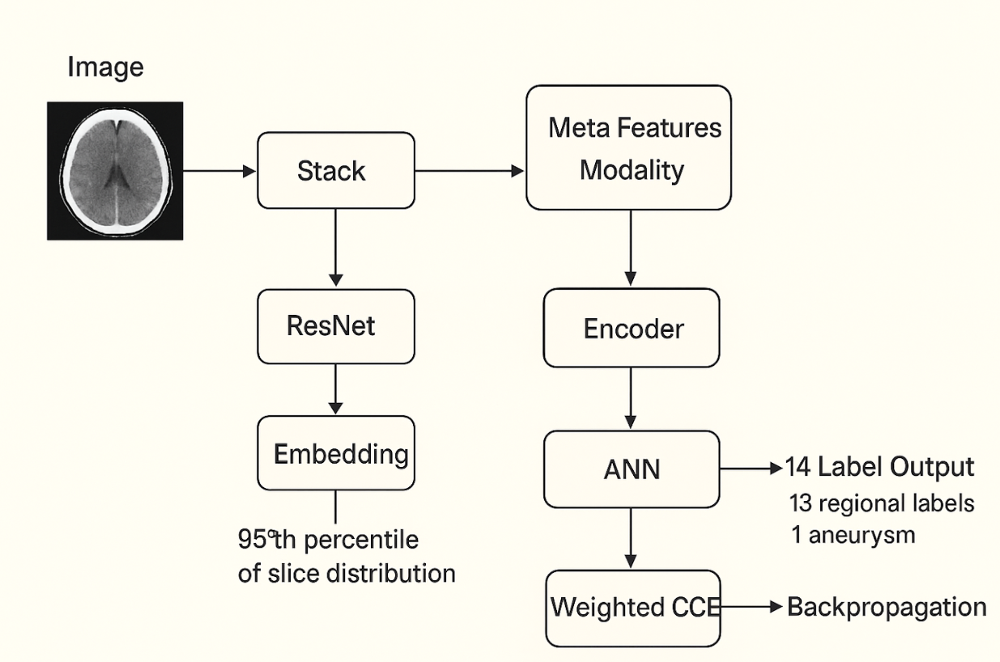
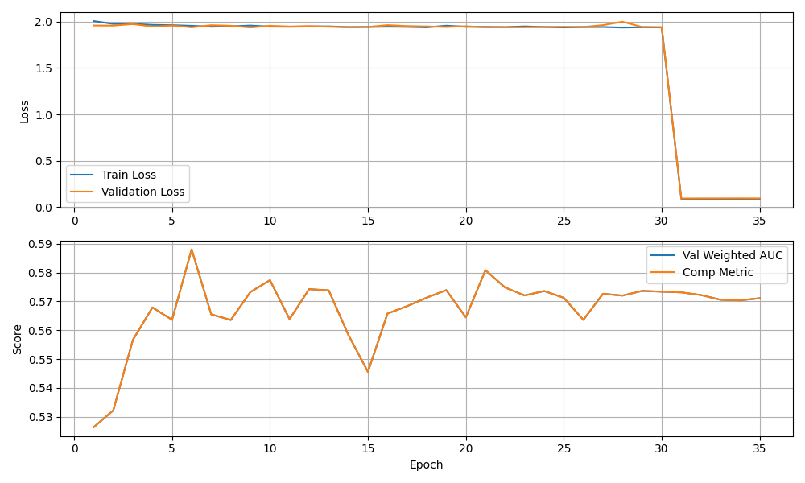

# RSNA Intracranial Aneurysm Challenge 2025 

## 1. Understanding the Challenge

The RSNA Intracranial Aneurysm Challenge is a **multi-label classification task**, where we aim to predict the presence of aneurysms across multiple anatomical regions in the brain. The competition also provides **segmentation data**, which we plan to leverage for **backbone pretraining and fine-tuning**.

### Key Challenges:

* **Heterogeneous data:** Images come from different institutions with varying acquisition protocols.
* **Multiple modalities:** Includes CTA, MRI (T1, T2), and MRA data. However, **each patient has only one modality**, leading to class imbalance across modalities.
* **Large-scale dataset:** \~314 GB of DICOM data requiring efficient handling and preprocessing.
* **Longitudinal/Sequential nature:** The data represents volumetric scans (3D), so we must respect slice order (z-index) for learning anatomical context.

---

## 2. Research & Exploration

Our initial research focused on understanding medical imaging pipelines and 3D visualization. Topics explored include:

* DICOM tags such as **ImagePositionPatient** and **SliceThickness** for correct stacking.
* Visualization using **3D Slicer** to explore voxel-based data.
* Use of **MONAI** for medical imaging preprocessing.
* Sequential modeling strategies for volumetric data.

📂 **Research Materials:** Found in `research_materials/` folder.

---

## 3. Dataset

* **Size:** \~314 GB
* **Format:** DICOM series per patient
* **Processing:** Converted DICOM series to `.npy` arrays sorted by z-index.
* **Normalization:** Per-scan min-max normalization.
* **Resizing:** Resized slices to `224×224`.
* **Storage:** Compressed embeddings occupy \~1.9 GB, enabling efficient loading.

---

## 4. Approach 1 – RadImageNet + GRU

Our first approach used **RadImageNet pretrained embeddings** + a **Bidirectional LSTM/GRU recurrent model** for classification.

### Training Details:

* **Hardware:** NVIDIA T4 GPU (Colab)
* **Epochs:** 35
* **Batch Size:** 8
* **Loss Function:** Weighted Categorical Cross-Entropy

  * Anatomical region labels: weight = 1.0
  * Final aneurysm label: weight = 13.0
* **Optimizer:** Adam with weight decay `1e-5`
* **Learning Rate:** `1e-4` with decay schedule


### Metrics & Results:

* **Best Validation AUC:** `0.5880`
* **Final Test Score:** `0.59`

Some labels achieved high AUC, while others were poor (see per-label AUC table below). This indicates that our backbone may not be sufficiently specialized for aneurysm features.
# RSNA Intracranial Aneurysm Challenge 2025 – Project Readme

## 1. Understanding the Challenge

The RSNA Intracranial Aneurysm Challenge is a **multi-label classification task**, where we aim to predict the presence of aneurysms across multiple anatomical regions in the brain. The competition also provides **segmentation data**, which we plan to leverage for **backbone pretraining and fine-tuning**.

### Key Challenges:

* **Heterogeneous data:** Images come from different institutions with varying acquisition protocols.
* **Multiple modalities:** Includes CTA, MRI (T1, T2), and MRA data. However, **each patient has only one modality**, leading to class imbalance across modalities.
* **Large-scale dataset:** \~314 GB of DICOM data requiring efficient handling and preprocessing.
* **Longitudinal/Sequential nature:** The data represents volumetric scans (3D), so we must respect slice order (z-index) for learning anatomical context.

---

## 2. Research & Exploration

Our initial research focused on understanding medical imaging pipelines and 3D visualization. Topics explored include:

* DICOM tags such as **ImagePositionPatient** and **SliceThickness** for correct stacking.
* Visualization using **3D Slicer** to explore voxel-based data.
* Use of **MONAI** for medical imaging preprocessing.
* Sequential modeling strategies for volumetric data.

📂 **Research Materials:** Found in `research_materials/` folder.


---

## 3. Dataset

* **Size:** \~314 GB
* **Format:** DICOM series per patient
* **Processing:** Converted DICOM series to `.npy` arrays sorted by z-index.
* **Normalization:** Per-scan min-max normalization.
* **Resizing:** Resized slices to `224×224`.
* **Storage:** Compressed embeddings occupy \~1.9 GB, enabling efficient loading.

---

## 4. Approach 1 – RadImageNet + GRU

Our first approach used **RadImageNet pretrained embeddings** + a **Bidirectional LSTM/GRU recurrent model** for classification.

### Training Details:

* **Hardware:** NVIDIA T4 GPU (Colab)
* **Epochs:** 35
* **Batch Size:** 8
* **Loss Function:** Weighted Categorical Cross-Entropy

  * Anatomical region labels: weight = 1.0
  * Final aneurysm label: weight = 13.0
* **Optimizer:** Adam with weight decay `1e-5`
* **Learning Rate:** `1e-4` with decay schedule

### Metrics & Results:

* **Best Validation AUC:** `0.5880`
* **Final Test Score:** `0.59`

Some labels achieved high AUC, while others were poor (see per-label AUC table below). This indicates that our backbone may not be sufficiently specialized for aneurysm features.

### Training History (Loss, AUC- More can be found in `src\model_traininig\models\radImagenet+gru_0.59\artifacts`)


---

## 5. Next Steps

* **Improve Backbone:** Move towards **UNet-style architectures** to leverage segmentation data for pretraining.
* **Add Transformers:** Incorporate **vision transformers** for better modeling of long-range dependencies.
* **Better Augmentation:** Explore modality-specific augmentation strategies.
* **Hyperparameter Tuning:** Optimize learning rate schedules, class weights, and regularization.

---

## 6. Artifacts

Model artifacts and logs are stored here:

```
src/model_traininig/models/radImagenet+gru_0.59
```

---

## 7. Key Takeaways

* The GRU approach demonstrated the importance of sequential context but plateaued at \~0.59 AUC.
* Backbone selection is critical — segmentation-aware models may boost performance.
* The multimodal and class-imbalanced nature of the data remains the primary challenge.

---

## 8. Future Work

* Implement **multi-task learning** (classification + segmentation).
* Experiment with **3D CNNs or Swin Transformers** to better model volumetric data.
* Investigate **domain adaptation techniques** to handle inter-institutional variability.

### Training History (Loss, AUC)

📊 *(Insert training/validation loss & AUC plots here)*

---

## 5. Next Steps

* **Improve Backbone:** Move towards **UNet-style architectures** to leverage segmentation data for pretraining.
* **Add Transformers:** Incorporate **vision transformers** for better modeling of long-range dependencies.
* **Better Augmentation:** Explore modality-specific augmentation strategies.
* **Hyperparameter Tuning:** Optimize learning rate schedules, class weights, and regularization.

---

## 6. Artifacts

Model artifacts and logs are stored here:

```
src/model_traininig/models/radImagenet+gru_0.59
```

---

## 7. Key Takeaways

* The GRU approach demonstrated the importance of sequential context but plateaued at \~0.59 AUC.
* Backbone selection is critical — segmentation-aware models may boost performance.
* The multimodal and class-imbalanced nature of the data remains the primary challenge.

---

## 8. Future Work

* Implement **multi-task learning** (classification + segmentation).
* Experiment with **3D CNNs or Swin Transformers** to better model volumetric data.
* Investigate **domain adaptation techniques** to handle inter-institutional variability.
