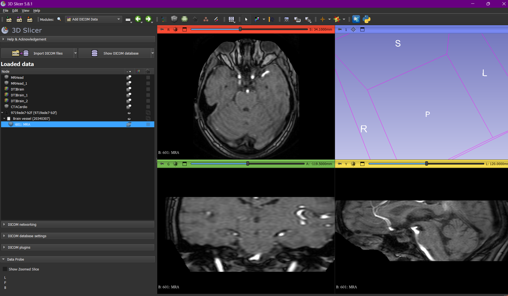

# rsna_anuerysm

- Research papers read for 3-d images and voxels and medical imaging
- Data vizualization in 3-d slicer tool for medical imaging

- Segmentaion visualisation in src\data_viz\data_viz.ipynb

- Creation of data pipeline via gdrive